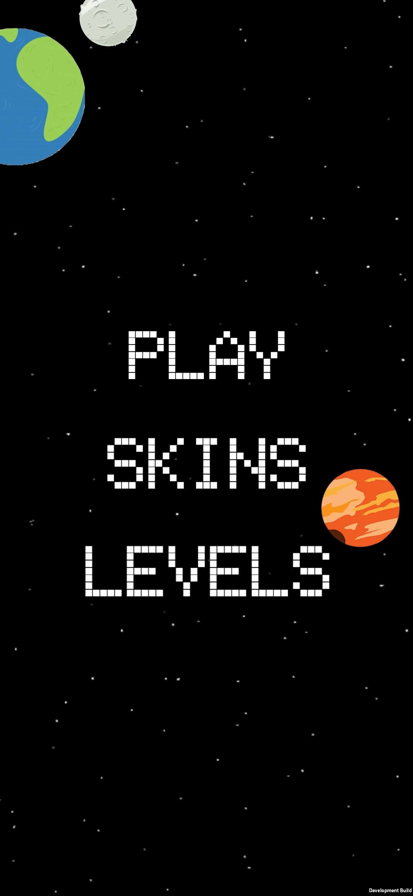
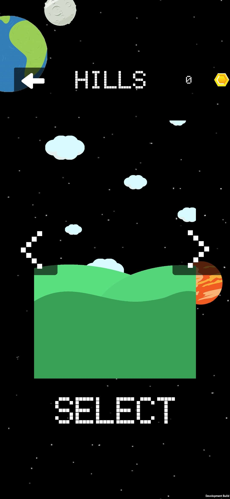
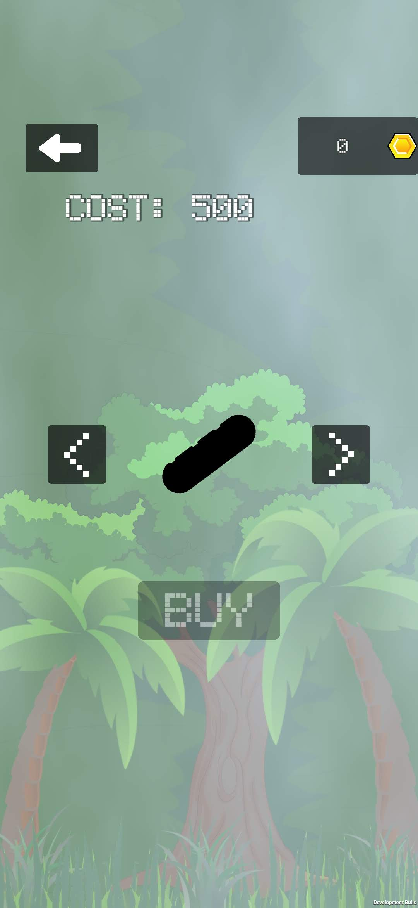
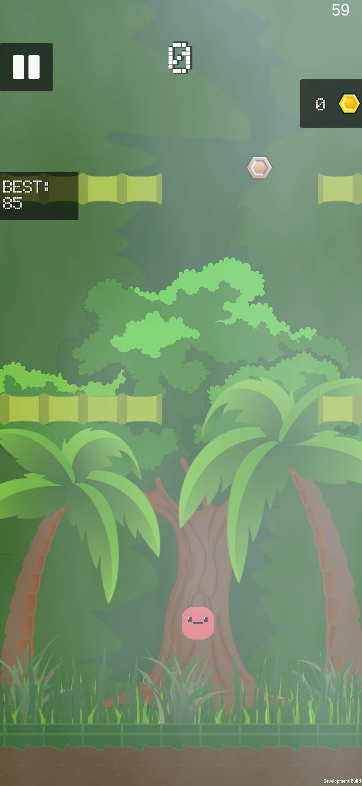
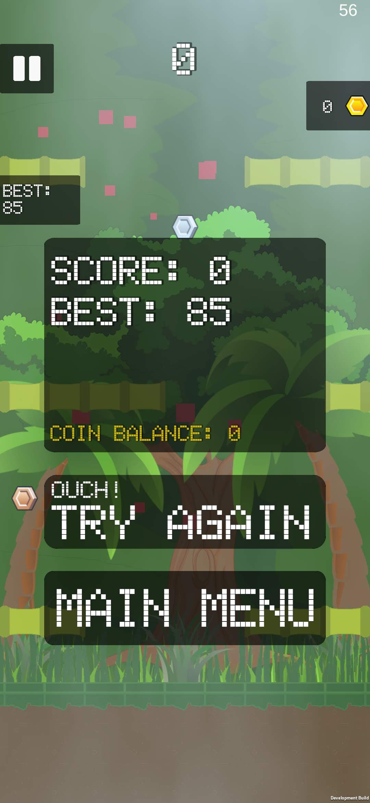
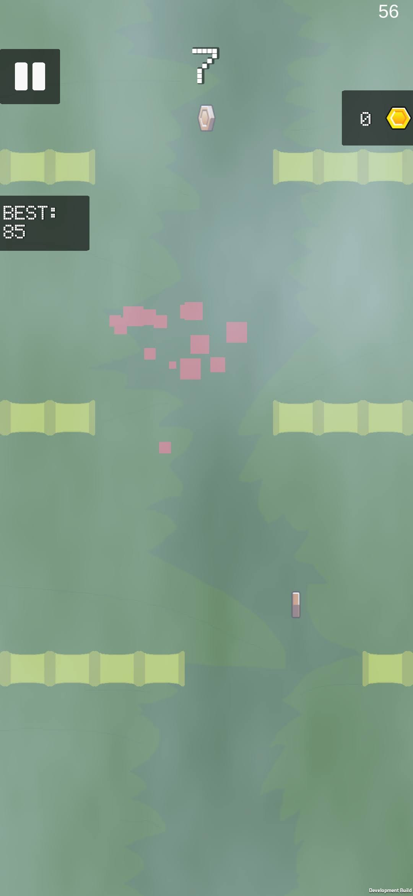

# up_game

⚠️ I started this project some years ago because I wanted to learn how to build games, but later abandoned it (run out of ideas). Maybe one day I'll finish it. In the meantime, here's what it looks like! ⬇️

  

  

  

  

  

  

Unity game built with unity v2019.2.6f1
